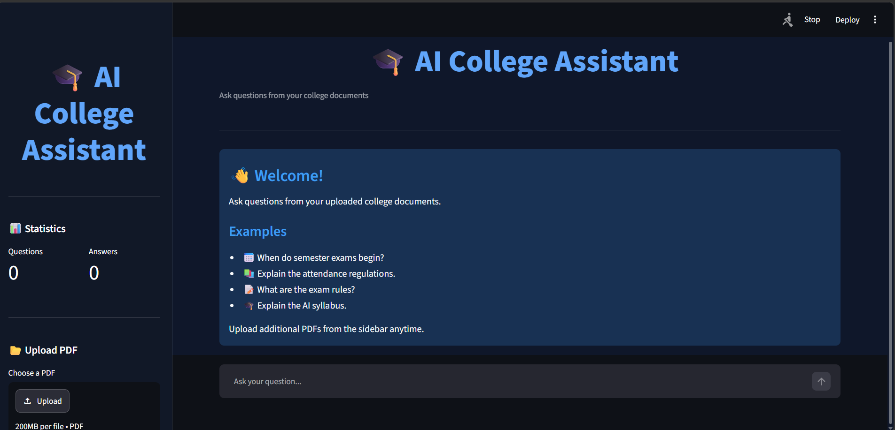
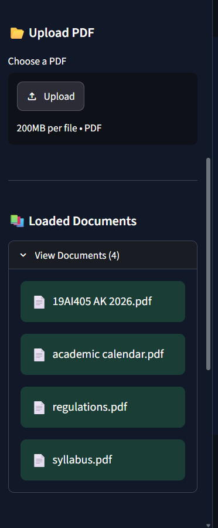
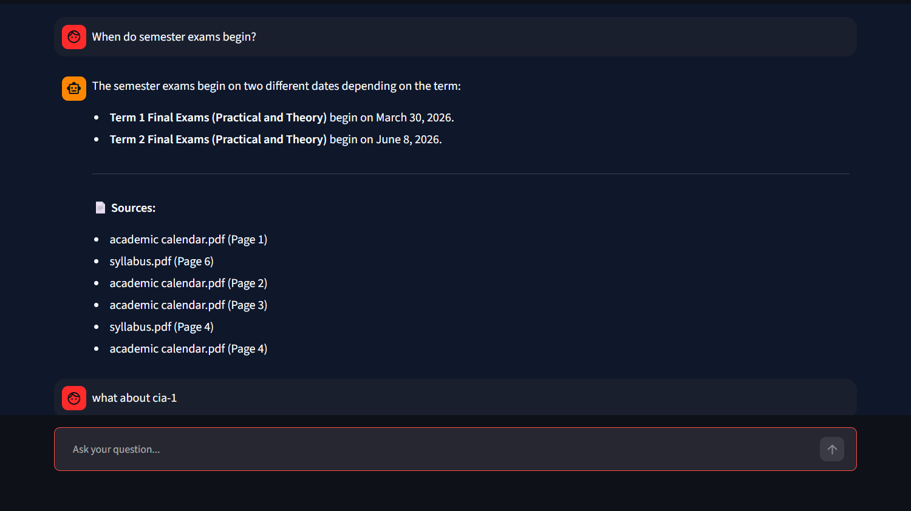
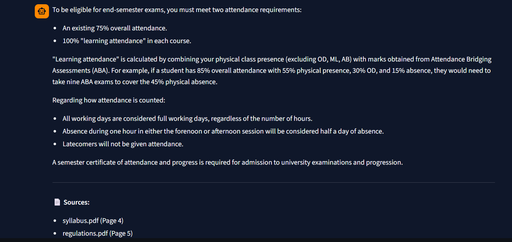
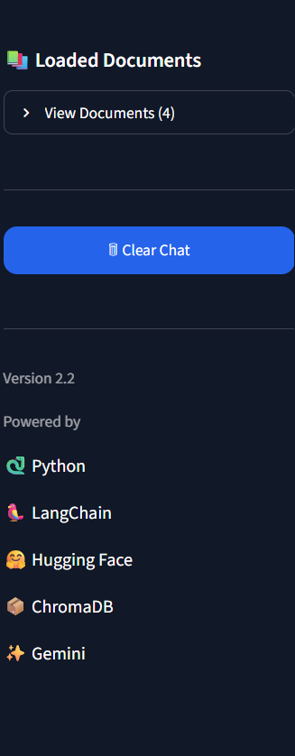

# 🎓 AI College Assistant (RAG)

An AI-powered College Assistant built using **LangChain**, **Google Gemini**, **Hugging Face Embeddings**, **ChromaDB**, and **Streamlit**.

This project uses **Retrieval-Augmented Generation (RAG)** to answer questions from uploaded college documents such as academic calendars, regulations, and syllabi.

---

## 🚀 Features

* 📄 PDF Upload & Processing
* 🤖 AI-powered Question Answering
* 🔍 Semantic Search
* 🧠 Retrieval-Augmented Generation (RAG)
* 💬 Conversation Memory
* 📚 Multi-document Support
* ⚡ Google Gemini Integration
* 📦 ChromaDB Vector Database
* 🎨 Interactive Streamlit UI

---

## 🛠 Tech Stack

| Technology    | Purpose              |
| ------------- | -------------------- |
| Python        | Programming Language |
| Streamlit     | Web Application      |
| LangChain     | RAG Pipeline         |
| Google Gemini | Large Language Model |
| Hugging Face  | Embedding Model      |
| ChromaDB      | Vector Database      |

---

## 🏗 Architecture

```text
PDF Documents
      │
      ▼
Document Loader
      │
      ▼
Text Chunking
      │
      ▼
Embeddings
(Hugging Face)
      │
      ▼
ChromaDB
(Vector Store)
      │
      ▼
Retriever
      │
      ▼
Google Gemini
      │
      ▼
Final Answer
```

---

## 📂 Project Structure

```text
AI-College-Assistant-RAG/
│
├── app/
├── assets/
├── data/
├── src/
├── tests/
├── README.md
├── requirements.txt
├── LICENSE
└── .gitignore
```

---

## 📸 Screenshots

### Home Page



---

### Upload PDF



---

### Chat Interface



---

### Generated Answer



---

### Sidebar



---

## ⚙ Installation

```bash
git clone https://github.com/Romanshyam/AI-College-Assistant-RAG.git

cd AI-College-Assistant-RAG

pip install -r requirements.txt

streamlit run app/app.py
```

---

## 🎯 Future Improvements

* Source page citations
* Multi-file upload
* Authentication
* Cloud deployment
* Voice interaction
* Advanced AI Agents

---

## 👨‍💻 Author

**E. Shyam Kumar**

B.Tech Artificial Intelligence & Data Science

Saveetha Engineering College

GitHub: https://github.com/Romanshyam
